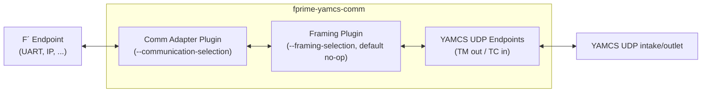
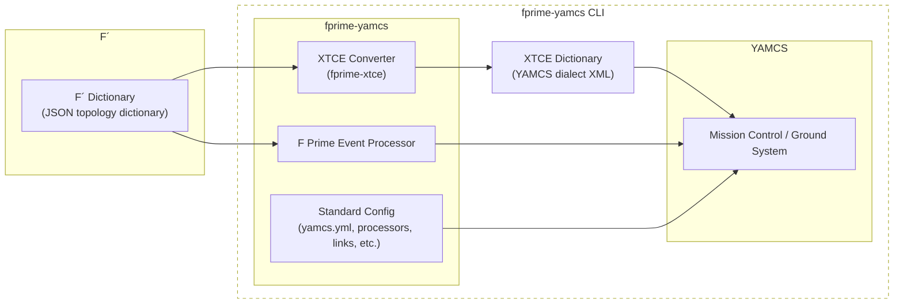

# fprime-yamcs: A YAMCS to F Prime Bridge Package

fprime-yamcs is designed to run YAMCS as the ground system when working with fprime. It operates similar to fprime-gds where it launches YAMCS in-lieu of the fprime-gds data pipelines.

## Requirements

`fprime-yamcs` requires the users to have `mvn` installed. See: [https://maven.apache.org/](https://maven.apache.org/).

> [!CAUTION]
> `mvn` requires JDK to be installed

## Usage

Install this package and run `fprime-yamcs` on a compatible F Prime deployment.

## fprime-yamcs-events: Event Processor

`fprime-yamcs-events` runs the F Prime event processor standalone: it reads the F Prime JSON topology dictionary and publishes F Prime events into YAMCS. It is launched automatically by `fprime-yamcs`; run it directly when operating YAMCS without the full `fprime-yamcs` launcher.

## fprime-yamcs-comm: Communication Bridge

`fprime-yamcs-comm` bridges bidirectional communication between an F Prime endpoint and the YAMCS UDP intake/outlet:

- The endpoint side is reached through an F Prime GDS **communication adapter plugin** (`--communication-selection`: `uart`, `ip`, or any installed adapter plugin).
- The YAMCS side pushes deframed packets as UDP datagrams to the telemetry intake (`--tm-host`/`--tm-port`, default `127.0.0.1:50000`) and receives command datagrams on a local UDP port (`--tc-host`/`--tc-port`, default `127.0.0.1:50001`). Command datagrams are only accepted from the TM host, loopback (`127.0.0.1`), and any hosts supplied via `--tc-allowed-source`; hostnames are resolved to IPv4 addresses once at startup and compared against the datagram source IP.
- One stage of framing/deframing sits in between, provided by an F Prime GDS **framing plugin** (`--framing-selection`). The default is the packaged `no-op` framer/deframer, which passes data through unchanged since YAMCS nominally performs framing/deframing itself. Select `fprime` to apply the standard F Prime framing (start word, length, data, checksum) on the endpoint side.

> [!NOTE]
> The UDP-transport requirement described under [Caveats](#caveats) applies to connecting F Prime directly to YAMCS; `fprime-yamcs-comm` lifts it by bridging non-UDP endpoints (e.g. UART) to the YAMCS UDP links.

> [!WARNING]
> With `no-op` framing over a stream-oriented adapter (`uart`, `ip`), packet boundaries depend on read timing: packets may be split or merged across UDP datagrams. Use a boundary-recovering framing plugin (e.g. `--framing-selection fprime`) unless the endpoint stream carries self-delimiting data that YAMCS deframes. The bridge warns on startup for the built-in stream adapters only; third-party stream adapters are not detected.

Operational notes: the bridge exits with a non-zero code if either data pump fails abnormally, so supervisors can detect and restart it; buffered downlink data that the framing plugin cannot deframe is discarded (with a warning) once it exceeds ten maximum-size datagrams (~640 KB).

Example, bridging a UART device to YAMCS with F Prime framing recovering packet boundaries (all UDP flags shown use their default values):

```
fprime-yamcs-comm --communication-selection uart --uart-device /dev/ttyUSB0 --uart-baud 115200 \
    --framing-selection fprime --tm-host 127.0.0.1 --tm-port 50000 --tc-port 50001
```



### Testing

The bridge's integration tests (`tests/test_comm_bridge.py`) require `socat` to emulate a UART endpoint; without it only the unit tests run (the integration tests are skipped). CI environments running these tests should install `socat`.

## Configuration 

YAMCS is powerful and has many configuration properties. `fprime-yamcs` requires one instance of YAMCS defined in the configuration to have the following MDB:

```
mdb:
   - type: xtce
     args:
        file: .../fprime.xtce.xml
```

This is to allow for automatic dictionary generation. Users declining this service must specify: `--no-convert-dictionary`.

## Optional: SDLS Key Management (ML-KEM-768 OTAR)

An optional YAMCS service, `gov.jpl.nasa.fprime.keymgmt.KeyManagementService`, provides post-quantum session key establishment for SDLS-secured links, compliant with the CCSDS 355.1-B-1 (SDLS Extended Procedures) OTAR procedure in its Annex D "Baseline Implementation Mode". It is **not enabled by default**.

The key model is a two-tier hierarchy: an ML-KEM-768 (FIPS 203) key pair is pre-loaded (private key on the spacecraft, public key on the ground) and serves as the master tier. Each rekey performs an ML-KEM encapsulation whose shared secret acts as the transaction master key (KEK), then uploads a fresh AES-256 session key under that KEK using a standard OTAR Command PDU, followed by Key Activation and Key Verification PDUs. The session key is simultaneously installed into YAMCS's built-in SDLS layer (AES-256-GCM) so both ends of the link stay synchronized.

Requirements: an OpenSSL binary version 3.5 or newer (the first release with ML-KEM support), configurable via `opensslBinary`.

Enable by adding the service to the instance configuration:

```yaml
services:
  - class: gov.jpl.nasa.fprime.keymgmt.KeyManagementService
    args:
      publicKeyFile: etc/mlkem768-pub.pem   # spacecraft ML-KEM-768 public key (PEM)
      kemApid: 0x20                         # APID of the KEM ciphertext packet
      epApid: 0x21                          # APID of the SDLS EP PDU packets
      uplinkLink: UDP_TC_OUT.vc1            # TC link handling the uplink
      masterKeyId: 1                        # key ID reported for the KEM-derived KEK
      firstSessionKeyId: 128                # session key IDs count up from here
      opensslBinary: openssl                # OpenSSL >= 3.5
      sdlsTargets:                          # ground SDLS SAs to rekey (optional)
        - link: UDP_TC_OUT
          spi: 1
```

A minimal operator UI is served at `http://<yamcs>/keymgmt/` with an "Uplink New Key" button, key inventory, and lifecycle states. The HTTP API endpoints are `POST /keymgmt/api/rekey`, `GET /keymgmt/api/inventory`, and `GET /keymgmt/api/status` (all require the `ControlLinks` system privilege).

The flight-side counterpart (KEM decapsulation and EP PDU processing in F´) is under development; until it can emit Key Verification replies, keys report as "unverified".

## Caveats

Currently, the default configuration of YAMCS requires F Prime to connect a CCSDS TC/TM framer/deframer to the Drv.Udp component ensuring that UDP is the transport mechanism.


